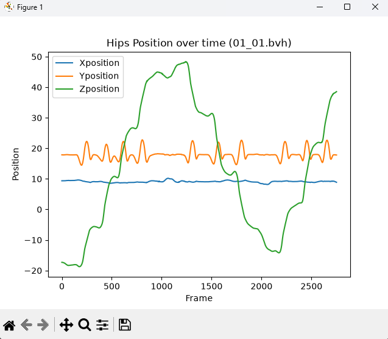
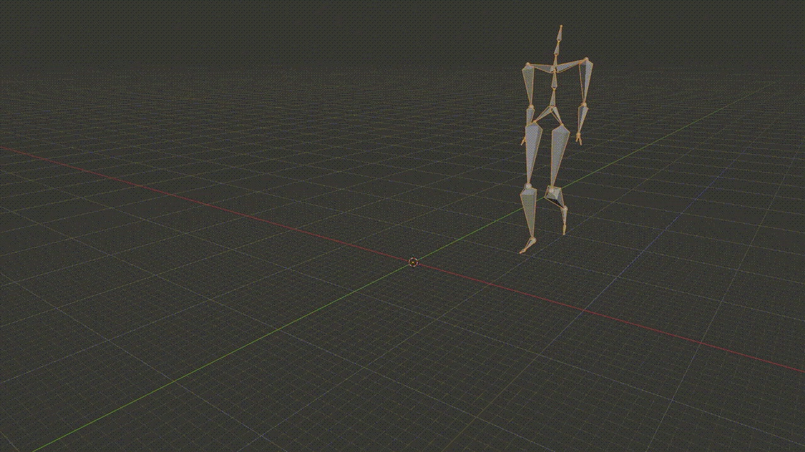

# Mocap BVH Toolkit

Small Python + Blender toolkit for parsing and visualizing BVH motion capture data, built while exploring the motion capture / tools development domain.

## What it does

- Parses BVH files from scratch: skeleton hierarchy (JOINT/ROOT), per-joint channel definitions, full frame-by-frame motion data
- Extracts and visualizes joint position/rotation over time (matplotlib)
- Batch-renders BVH animations to video via Blender's Python API — drop a folder of BVH files in, get a video per file out, no manual clicking

## Why

Built this to get hands-on with the BVH format and motion capture data pipeline — dataset used: [CMU Motion Capture Database](http://mocap.cs.cmu.edu/).

## Structure

bvh_parser/

├── read_bvh_file.py

└── In/ # drop .bvh files here

blender_render/

├── batch_render.py

├── In/ # drop .bvh files here

└── Out/ # rendered videos land here

## Usage

### Parser

Place `.bvh` files in `bvh_parser/In/`, then:

\`\`\`bash
python bvh_parser/read_bvh_file.py
\`\`\`

Parses every BVH file in the folder and plots hip position/rotation over time for each.

### Blender batch render

Place `.bvh` files in `blender_render/In/`.

**Current version** — run inside Blender, with the script open in the Scripting tab, scene visible (uses viewport/OpenGL rendering):

1. Open Blender, load `batch_render.py` in the Scripting tab
2. Run the script (Alt+P or the Run button)
3. Rendered videos appear in `blender_render/Out/`

**Planned:** headless run from the command line using Blender's full (non-viewport) renderer:
\`\`\`bash
blender --background --python blender_render/batch_render.py
\`\`\`
(requires switching `bpy.ops.render.opengl(animation=True)` to `bpy.ops.render.render(animation=True)`, which needs a properly lit/camera-framed scene rather than relying on the viewport)

## Example output

## What's next

- Headless rendering via `bpy.ops.render.render()` instead of viewport/OpenGL
- Forward kinematics (using `OFFSET`) to compute true joint positions in space, not just raw channel values
- Retargeting motion onto a rigged character mesh instead of a bare skeleton

## License

MIT
